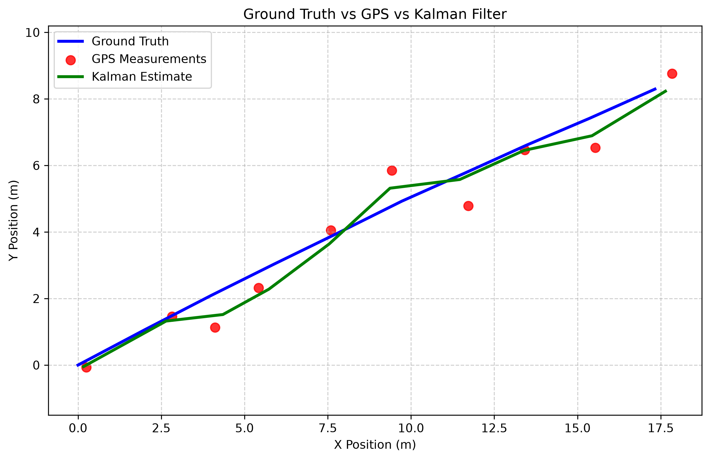
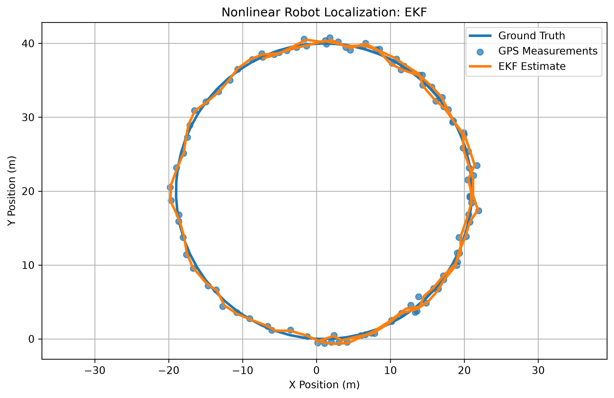
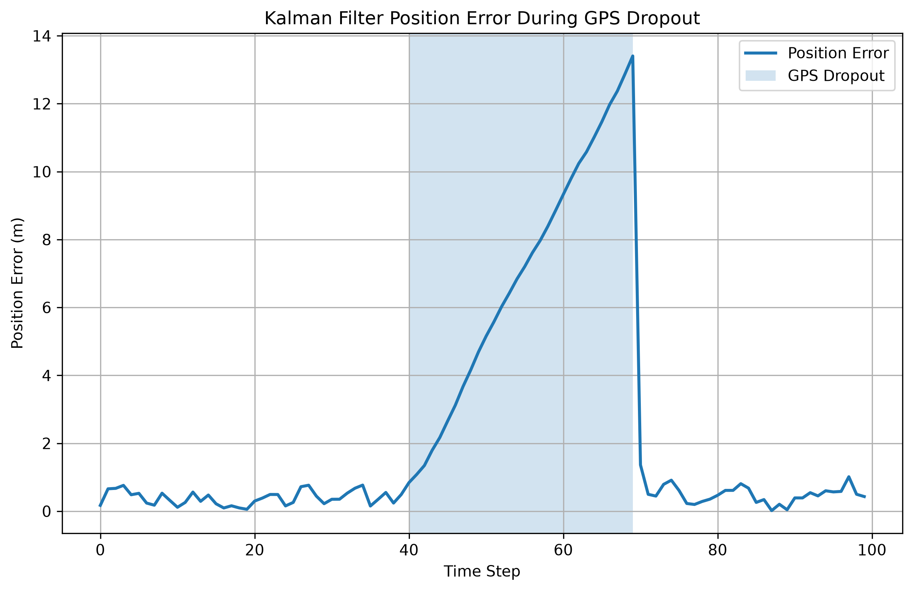
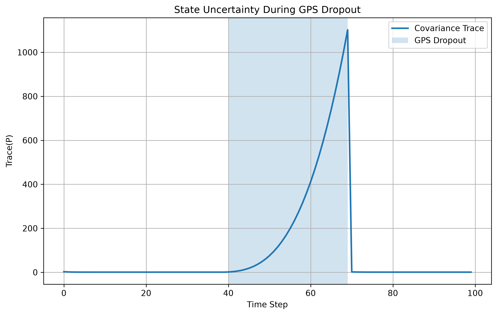
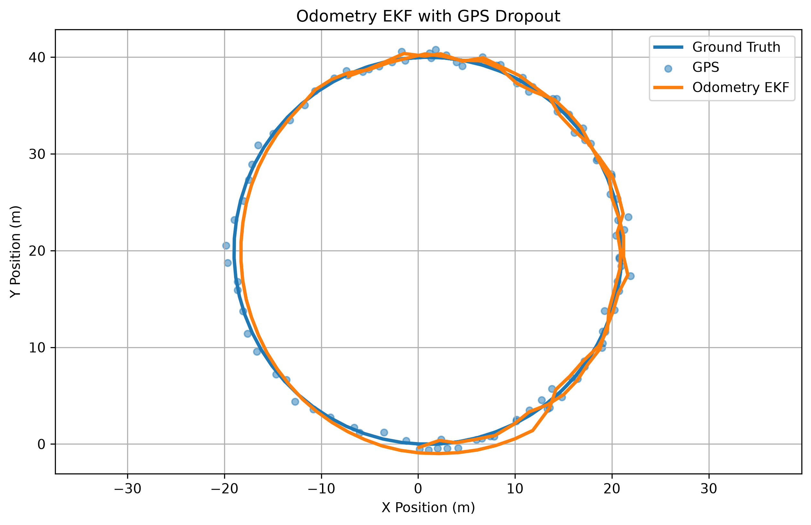
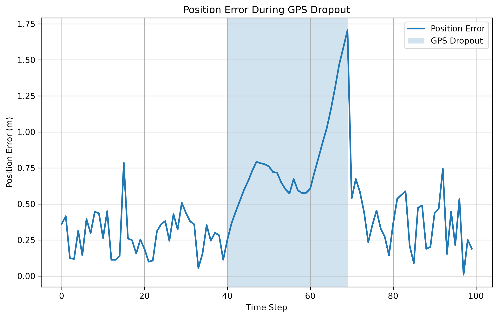

# Kalman Filter From Scratch

This repository contains a complete implementation of a Linear Kalman Filter (KF) and an Extended Kalman Filter (EKF) built entirely from scratch for a simulated 2D robot localization problem.

## Objectives

- Implement the Kalman Filter without external filtering libraries
- Simulate robot motion with noisy sensors
- Estimate the robot state using probabilistic filtering
- Analyze filter performance under different failure scenarios
- Extend the implementation to an Extended Kalman Filter
- Fuse GPS and odometry measurements for nonlinear localization
- Evaluate estimator uncertainty during sensor failure

## Repository Structure

```text
src/        Source code
docs/       Mathematical derivations and technical documentation
tests/      Unit tests
data/       Simulated data
results/    Evaluation results, plots, and experiment outputs
```

## Documentation

Detailed mathematical and implementation documentation is available in the
`docs/` directory:

- [Kalman Filter](docs/kalman_filter.md) — Linear KF formulation and implementation
- [Kalman Filter Derivation](docs/derivation.md) — Mathematical derivation of the linear KF
- [Kalman Equations](docs/kalman_equations.md) — Quick reference for the main equations
- [Extended Kalman Filter](docs/extended_kalman_filter.md) — Nonlinear EKF formulation
- [Odometry Sensor Fusion](docs/odometry_sensor_fusion.md) — Odometry model and GPS + odometry EKF
- [Failure Mode Analysis](docs/failure_modes.md) — GPS dropout, uncertainty growth, and recovery

---

# Results

## 1. Linear Kalman Filter

The Linear Kalman Filter uses a constant-velocity model with a four-dimensional
state:

$$ \mathbf{x} = \begin{bmatrix} x & y & v_x & v_y \end{bmatrix}^T $$

GPS provides noisy measurements of the robot's $x$ and $y$ position.

### Multi-Run Evaluation

The linear Kalman Filter was evaluated across 50 independent random
simulations, with 100 time steps per simulation.

| Metric | Result |
|---|---:|
| GPS RMSE | 0.7055 ± 0.0380 m |
| Kalman RMSE | 0.4908 ± 0.0352 m |
| RMSE Improvement | 30.44 ± 3.17% |

The results show that the Kalman Filter consistently improves localization
accuracy compared with raw GPS measurements.

### Linear KF Trajectory

The trajectory below compares the simulated robot trajectory with the noisy
GPS measurements and Kalman Filter estimate.



---

## 2. Extended Kalman Filter

The nonlinear experiment uses a unicycle-style robot model with the state:

$$ \mathbf{x} = \begin{bmatrix} x & y & \theta & v & \omega \end{bmatrix}^T $$

The nonlinear motion model uses:

$$ x_{k+1} = x_k + v_k\cos(\theta_k)\Delta t $$

$$ y_{k+1} = y_k + v_k\sin(\theta_k)\Delta t $$

$$ \theta_{k+1} = \theta_k+\omega_k\Delta t $$

Because the motion model is nonlinear, the EKF linearizes it using a
state-dependent Jacobian.

### Single-Run Evaluation

| Metric | Result |
|---|---:|
| GPS RMSE | 0.6224 m |
| EKF RMSE | 0.4793 m |
| Improvement | 23.00% |

### Multi-Run Evaluation

The EKF was evaluated over 50 independent simulations, with 100 time steps
per simulation.

| Metric | Result |
|---|---:|
| GPS RMSE | 0.7002 ± 0.0378 m |
| EKF RMSE | 0.5596 ± 0.0406 m |
| RMSE Improvement | 20.12 ± 3.05% |

The multi-run experiment shows that the EKF consistently improves localization
accuracy across different noise realizations rather than depending on a
single favorable simulation.

### EKF Trajectory

The nonlinear experiment compares the ground-truth trajectory, noisy GPS
measurements, and EKF estimate.



---

## 3. GPS Dropout and Failure Modes

A key part of the project is evaluating how a probabilistic localization
system behaves when GPS measurements become unavailable.

The experiments examine:

1. Position error during GPS dropout
2. Growth of estimator uncertainty
3. Recovery when GPS measurements return

### Linear KF GPS Dropout

GPS measurements are removed for steps 40–69 of a 100-step simulation.

| Metric | Before Dropout | During Dropout | After Recovery |
|---|---:|---:|---:|
| Position Error | 0.4923 m | 13.4045 m | 1.3628 m |
| Covariance Trace | 0.7526 | 1102.0521 | 1.8278 |

Without GPS, the linear filter relies on its motion model. Prediction errors
accumulate and uncertainty increases.

When GPS becomes available again, the measurement update reduces uncertainty
and pulls the estimate back toward the true trajectory.

#### Linear KF Position Error



#### Linear KF Covariance Growth



---

## 4. Odometry Sensor Fusion

The project also introduces a simulated odometry sensor measuring:

$$ \mathbf{u} = \begin{bmatrix} v_{\mathrm{odom}} \\ \omega_{\mathrm{odom}} \end{bmatrix} $$

The sensor contains Gaussian measurement noise and slowly changing bias.

A separate three-state EKF estimates:

$$ \mathbf{x} = \begin{bmatrix} x & y & \theta \end{bmatrix}^T $$

while using measured velocity and angular velocity as control inputs.

### GPS + Odometry Evaluation

With both GPS and odometry available:

| Metric | Result |
|---|---:|
| GPS RMSE | 0.6224 m |
| EKF RMSE | 0.5607 m |
| RMSE Improvement | 9.91% |

The improvement is modest because GPS is already available at every timestep.
The main advantage of odometry becomes more apparent during GPS outages.

---

## 5. Odometry Drift + GPS Dropout

The nonlinear sensor-fusion experiment uses:

- 100 total simulation steps
- GPS dropout from steps 40–69
- Noisy GPS
- Noisy odometry
- Slowly drifting odometry bias

### Results

| Metric | Before Dropout | During Dropout | After Recovery |
|---|---:|---:|---:|
| Position Error | 0.1131 m | 1.7065 m | 0.5383 m |
| Covariance Trace | 0.5730 | 1288.0796 | 1.2440 |

During the outage, the EKF relies on odometry alone.

The position error increases:

$$ 0.1131 \rightarrow 1.7065\text{ m} $$

while uncertainty increases:

$$ 0.5730 \rightarrow 1288.0796 $$

When GPS returns, the filter reduces its uncertainty and the position error
falls to 0.5383 m.

This demonstrates an important property of probabilistic localization:
the estimator should become less confident when reliable absolute
measurements disappear.

### Odometry EKF Trajectory

The trajectory visualization compares ground truth, GPS measurements, and the
odometry-driven EKF estimate.



### Position Error During GPS Dropout



### Covariance Growth During GPS Dropout


---
## 6. Controlled Estimator Comparison

To compare the estimators under identical conditions, a controlled experiment
was performed using the same nonlinear trajectories, GPS measurements,
initial conditions, and random seeds.

The experiment used:

- 50 independent simulations
- 100 time steps per simulation
- Identical nonlinear ground-truth trajectories
- Identical GPS measurements for all estimators

Three localization approaches were compared:

1. Raw GPS measurements
2. GPS-only Extended Kalman Filter
3. GPS + Odometry Extended Kalman Filter

| Estimator | Position RMSE | Improvement vs GPS |
|---|---:|---:|
| GPS | 0.7002 ± 0.0378 m | — |
| GPS-only EKF | 0.5596 ± 0.0406 m | 20.12 ± 3.05% |
| GPS + Odometry EKF | 0.4416 ± 0.0381 m | 36.99 ± 3.37% |

The controlled comparison shows that, under the simulated conditions, incorporating
odometry into the nonlinear EKF provides a substantial improvement over both
raw GPS and GPS-only EKF.

Compared with the GPS-only EKF, GPS + odometry reduces the mean position RMSE
from 0.5596 m to 0.4416 m.

This corresponds to an approximately 21.1% reduction in RMSE relative to the
GPS-only EKF.

---

## 7. Odometry Bias Ablation

An ablation study was performed to investigate how slowly varying odometry
bias affects localization accuracy.

The instantaneous odometry measurement noise was kept fixed while the
random-walk bias drift was varied.

The experiment used:

- 50 independent simulations
- 100 time steps per simulation
- Fixed GPS noise
- Fixed instantaneous odometry noise
- Four levels of odometry bias drift

| Odometry Condition | EKF RMSE | Improvement vs GPS |
|---|---:|---:|
| White noise only | 0.3958 ± 0.0371 m | 43.52 ± 3.64% |
| Low bias drift | 0.3960 ± 0.0368 m | 43.49 ± 3.62% |
| Medium bias drift | 0.3987 ± 0.0361 m | 43.10 ± 3.62% |
| High bias drift | 0.4586 ± 0.0646 m | 34.52 ± 8.54% |

The results show that small odometry bias drift has little effect on
localization accuracy when GPS measurements are continuously available.

However, larger bias drift causes a noticeable degradation in both accuracy
and consistency.

The position RMSE increases from 0.3958 m under white-noise-only conditions
to 0.4586 m under high bias drift. The standard deviation also increases from
0.0371 m to 0.0646 m.

---

## 8. GPS Dropout × Odometry Bias Analysis

A further experiment investigated how odometry bias affects localization when
GPS measurements become temporarily unavailable.

GPS measurements were removed for steps 40–69 of a 100-step simulation.
During the outage, the EKF relied on odometry for motion propagation.

The experiment was repeated over 50 independent simulations.

| Odometry Condition | Before Dropout | During Dropout | After Recovery |
|---|---:|---:|---:|
| White noise only | 0.3539 ± 0.0491 m | 1.4250 ± 1.0506 m | 0.3646 ± 0.0605 m |
| Low bias drift | 0.3539 ± 0.0491 m | 1.4209 ± 0.9897 m | 0.3643 ± 0.0599 m |
| Medium bias drift | 0.3547 ± 0.0492 m | 1.8519 ± 1.1461 m | 0.3666 ± 0.0587 m |
| High bias drift | 0.3752 ± 0.0555 m | 6.8456 ± 4.3354 m | 0.4638 ± 0.1158 m |

The effect of odometry bias becomes substantially more pronounced during GPS
outages.

With white noise only, the mean position error during the dropout is
1.4250 m. Under high bias drift, the error increases to 6.8456 m.

The filter is therefore much more sensitive to accumulated odometry bias when
absolute GPS measurements are unavailable.

When GPS measurements return, the EKF reduces the accumulated error through
the GPS measurement update.

---


# Results Summary

| Experiment | GPS RMSE | Filter RMSE | Improvement |
|---|---:|---:|---:|
| Linear KF | 0.7055 ± 0.0380 m | 0.4908 ± 0.0352 m | 30.44 ± 3.17% |
| Nonlinear EKF | 0.7002 ± 0.0378 m | 0.5596 ± 0.0406 m | 20.12 ± 3.05% |
| GPS + Odometry EKF | 0.7002 ± 0.0378 m | 0.4416 ± 0.0381 m | 36.99 ± 3.37% |

The results demonstrate that filtering improves localization compared with
raw GPS measurements.

The failure-mode experiments additionally show that a well-designed
estimator should explicitly represent increasing uncertainty when reliable
absolute measurements become unavailable.

---

# Automated Tests

The project includes automated tests for the odometry sensor and
odometry-driven EKF.

Run:

```bash
pytest
```

Current test result:

```text
3 passed
```

The tests verify:

- Odometry measurement generation
- EKF nonlinear prediction
- GPS measurement update behavior

---

# Reproducibility

Experiments use fixed random seeds where appropriate so that individual
experiments can be reproduced.

The main evaluation scripts include:

```text
src/evaluate.py
src/evaluate_ekf.py
src/ekf_experiment.py
src/odometry_experiment.py
src/failure_modes.py
```

---

# Limitations

This is a simulation-based localization project and does not represent every
failure mode encountered by a physical robot.

Current limitations include:

- Simplified robot dynamics
- Simplified GPS measurement model
- Simplified odometry error model
- No real IMU data
- No wheel-slip model
- No GPS multipath or realistic urban canyon effects
- Fixed filter noise parameters
- No online fault-detection mechanism

The covariance growth observed during GPS outages is therefore an estimator
behavior under the chosen simulated noise model, rather than a prediction of
real-world uncertainty.

---

# Future Work

Potential extensions include:

- IMU integration
- Wheel encoder modeling
- Adaptive noise estimation
- GPS outlier rejection
- Innovation-based fault detection
- Sensor fault classification
- Robust Kalman filtering
- Interacting Multiple Model (IMM) filtering
- Real-world ROS 2 integration
- Evaluation on real robot datasets
